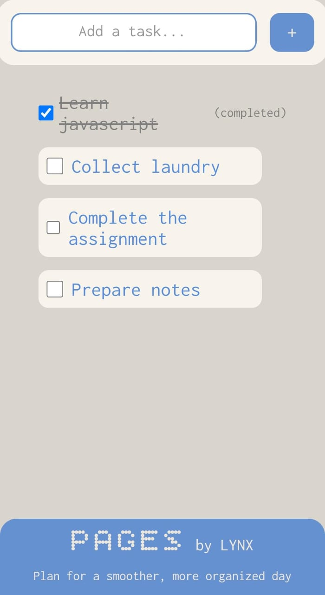

### 📘 Pages — A Minimal To-Do App

Pages is a clean and simple task-tracking web app designed with a soft aesthetic and smooth interactions.
It provides a distraction-free space to write down tasks, complete them, and stay organized throughout the day.

  

### 🚀 Features

- Add tasks easily using the input bar or Enter key  
  Tasks appear instantly with smooth styling and soft shadows.

- Complete tasks using a checkbox  
  When checked, tasks get a strike-through effect and a “(completed)” label.

- Automatic removal of completed tasks  
  Completed tasks fade out and disappear after a short delay.

- Empty-state message  
  A friendly “You have no tasks” message appears when the list is empty.

- Clean, minimal UI  
  Uses gentle colors, rounded shapes, and simple typography for calm focus.

### 🎨 Tech Stack

- HTML5 for structure  
- CSS3 for layout, colors, and animations  
- JavaScript for task management and event handling  
- Google Fonts for modern typography  
- GitHub Pages for hosting and deployment  

### 🌐 Live Demo

Try the app here:
https://aditya-ssr.github.io/Pages-by-LYNX/

### 🦊 About LYNX

Pages is part of the LYNX ecosystem, a collection of minimal productivity tools designed for clarity, simplicity, and everyday usability.
